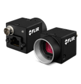
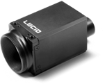
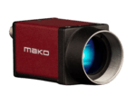
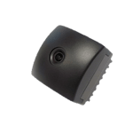
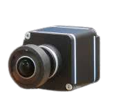

# CAMERAs

## **FLIR Machine Vision Cameras**

  

FLIR Machine Vision cameras which has ROS 2 driver and tested by one or more community members are listed below:

| Supported Products List | MP           | FPS        | Interface | Sensor Format | Lens   | ROS 2 Driver | Autoware Tested (Y/N) |
| ----------------------- | ------------ | ---------- | --------- | ------------- | ------ | ------------ | --------------------- |
| Blackfly S              | 2.0   5.0 | 22   95 | USB-GigE  | 1” - ⅔”       | C & CS | Y            | -                     |
| Grasshopper3            | 2.3   5.0 | 26   90 | USB-GigE  | 1” - ⅔”       | C & CS | Y            | -                     |
| Flea3                   | 1.3          | 60         | USB       | 1/1.8”        | C      | Y            | -                     |

Link to ROS 2 driver:  
[https://github.com/berndpfrommer/flir_spinnaker_ros2](https://github.com/berndpfrommer/flir_spinnaker_ros2)

Link to company website:  
[https://www.flir.eu/iis/machine-vision/](https://www.flir.eu/iis/machine-vision/)

## **Lucid Vision Cameras**

  

Lucid Vision cameras which has ROS 2 driver and tested by one or more community members are listed below:

| Supported Products List | MP  | FPS  | Interface | Sensor Format | Lens    | ROS 2 Driver | Autoware Tested (Y/N) |
| ----------------------- | --- | ---- | --------- | ------------- | ------- | ------------ | --------------------- |
| TRITON 054S             | 5.4 | 22   | GigE      | 1/1.55”       | C Mount | Y            | Y                     |
| TRITON 032S             | 3.2 | 35.4 | GigE      | 1/1.8”        | C Mount | Y            | Y                     |
| TRITON 050S             | 5.0 | 22   | GigE      | 2/3”          | C Mount | Y            | -                     |

Link to ROS 2 driver:  
[https://gitlab.com/leo-drive/Drivers/arena_camera](https://gitlab.com/leo-drive/Drivers/arena_camera)

Link to company website:  
[https://thinklucid.com/triton-gige-machine-vision/](https://thinklucid.com/triton-gige-machine-vision/)

## **Allied Vision Cameras**

  

Allied Vision cameras which has ROS 2 driver and tested by one or more community members are listed below:

| Supported Products List | MP  | FPS  | Interface | Sensor Format | Lens    | ROS 2 Driver | Autoware Tested (Y/N) |
| ----------------------- | --- | ---- | --------- | ------------- | ------- | ------------ | --------------------- |
| Mako G319               | 3.2 | 37.6 | GigE      | 1/1.8”        | C Mount | Y            | -                     |

Link to ROS 2 driver:  
[https://github.com/neil-rti/avt_vimba_camera](https://github.com/neil-rti/avt_vimba_camera)

Link to company website:  
[https://www.alliedvision.com/en/products/camera-series/mako-g](https://www.alliedvision.com/en/products/camera-series/mako-g)

## **Tier IV Cameras**

  

TierIV cameras which has ROS 2 driver and tested by one or more community members are listed below:

| Supported Products List | MP  | FPS | Interface | Sensor Format | Lens                                                 | ROS 2 Driver | Autoware Tested (Y/N) |
| ----------------------- | --- | --- | --------- | ------------- | ---------------------------------------------------- | ------------ | --------------------- |
| C1                      | 2.5 | 30  | GMSL2     | 1/2.57”       | 5-axis active adjustment  with adhesive dispense | Y            | Y                     |
| C2                      | 5.4 | 30  | GMSL2     | -             | 5-axis active adjustment  with adhesive dispense | -            | -                     |

Link to driver:  
[https://github.com/tier4/tier4_automotive_hdr_camera](https://github.com/tier4/tier4_automotive_hdr_camera)

Link to company website:  
[https://sensor.tier4.jp/automotive-camera](https://sensor.tier4.jp/automotive-camera)

## **Neousys Technology Camera**

  

Neousys Technology cameras which has ROS 2 driver and tested by one or more community members are listed below:

| Supported Products List | MP  | FPS | Interface                                                                                                                                                                        | Sensor Format | Lens                                            | ROS 2 Driver | Autoware Tested (Y/N) |
| ----------------------- | --- | --- | -------------------------------------------------------------------------------------------------------------------------------------------------------------------------------- | ------------- | ----------------------------------------------- | ------------ | --------------------- |
| AC-IMX390               | 2.0 | 30  | GMSL2   (over [PCIe-GL26 Grabber Card](https://www.neousys-tech.com/en/product/product-lines/in-vehicle-computing/vehicle-expansion-card/pcie-gl26-gmsl-frame-grabber-card)) | 1/2.7”        | 5-axis active adjustment with adhesive dispense | Y            | Y                     |

Link to ROS 2 driver:  
[https://github.com/ros-drivers/gscam](https://github.com/ros-drivers/gscam)

Link to company website:  
[https://www.neousys-tech.com/en/](https://www.neousys-tech.com/en/)
